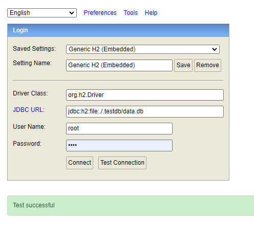

# Vote Manager

Projeto com o intuito de simular pautas de votação.

## Sobre o Projeto

1. Tecnologias: Java11, JUnit, SpringBoot, H2, MySQL, Swagger, Spring Data, Spring MVC.
2. IDE Utilizada: IntelliJ

## Como Iniciar a Aplicação

`No diretório .run existem duas configurações para build(maven clean install) e start(ApiApplication.run()) do
projeto.`

## Coleção no Postman

`Uma coleção do Postman com as solicitações de API está disponível no arquivo `vote-manager-collection.json` na raiz do
projeto. Você pode importar essa coleção no Postman e utilizá-la para testar as diferentes rotas da aplicação.`

## Banco de Dados

O projeto utiliza dois perfis de ambiente no Spring: `dev` e `prod`.

- Perfil `dev`: Nesse perfil, a aplicação utiliza o banco de dados H2 embutido. Ao subir a aplicação, será gerado um
  arquivo de banco de dados H2 está
  localizado no diretório `.testdb` na raiz do projeto e será carregado automaticamente quando a aplicação for iniciada
  no
  perfil de desenvolvimento. Com a aplicação no ar, acesse o BD pelo link
  do [H2 Console](http://localhost:8083/h2-console`)

- Perfil `prod`: Nesse perfil, a aplicação está configurada para utilizar o banco de dados MySQL. Certifique-se de ter
  um servidor MySQL instalado e configurado corretamente com um schema chamado `agendas`. As configurações de conexão
  com o banco de dados podem ser encontradas no arquivo `application-prod.properties`. Certifique-se de fornecer as
  informações corretas do banco de dados, como URL, nome do usuário e senha.

## Actuator

`A aplicação possui endpoints fornecidos pelo Spring Boot Actuator que permitem monitorar e gerenciar o estado da
aplicação em tempo de execução. Alguns dos principais endpoints são:`

- **/actuator/health**: Retorna o status de saúde da aplicação.
- **/actuator/info**: Retorna informações sobre a aplicação.
- **/actuator/metrics**: Retorna métricas da aplicação, como uso de CPU, memória e threads.
- **/actuator/env**: Retorna informações sobre as propriedades de configuração da aplicação.
- **/actuator/loggers**: Permite visualizar e configurar os loggers da aplicação.

As requisições do Actuator estão na coleção do Postman.

## Swagger

`A documentação da API também está disponível por meio do Swagger. Para acessar o Swagger, inicie a aplicação e acesse a
seguinte URL no navegador:` [Swagger](http://localhost:8083/swagger-ui/index.html#)

## Funcionamento da Aplicação

1. **Criação da Pauta**

       A criação da pauta é o primeiro passo do processo. Nessa etapa, são fornecidos os dados da pauta, como título e
       descrição, além do período em que a pauta ficará aberta para votação.

   **Validações:**
    - A pauta só pode ser criada após o horário atual.
    - O horário final da pauta não pode ser anterior ao horário inicial.
    - Caso o usuário não informe o horário final, será considerado um minuto após o horário inicial.

2. **Votação da Pauta**

       Após a criação da pauta, os usuários podem votar utlilizando o ID da Pauta, o CPF do usuário e o resultado do
       voto: `Sim ou Não`.

   **Validações:**
    - Só é possível votar em pautas que estão abertas para votação. Ou seja, não é possível votar antes do horário de
      início da pauta ou após o horário de encerramento.
    - Cada usuário só pode votar uma vez em cada pauta, ou seja, apenas um voto por CPF é permitido para cada pauta.
    - Há uma validação de CPF via endpoint, onde ele consulta se o CPF é válido ou não, mas como o endpoint não está no
      ar, é possível habilitar um mock para simular a resposta desejada.

3. **Consulta de Pautas:**

       Os usuários têm duas opções para consultar as pautas:
   3.1 **Consultar todas as Pautas:**

    - Os usuários podem consultar todas as pautas disponíveis.
    - Esta consulta retorna uma lista de pautas com informações genéricas, incluindo os dados básicos da pauta e os
      votos registrados até o momento.

   3.2 **Consulta de uma Pauta Específica:**

    - Os usuários podem consultar uma pauta específica para obter informações mais detalhadas.
    - Esta consulta retorna o resultado do voto (APPROVED ou NOT_APPROVED), o status da pauta (CLOSED ou OPEN) e os
      dados completos da agenda, incluindo os votos registrados.
    - O resultado do voto será "APPROVED" se houver mais votos "Sim" do que votos "Não". Caso contrário, o resultado não
      será exibido como "APPROVED". Caso a pauta esteja aberta, o resultado será ON_GOING até que ela termine.
    - O status da pauta será "CLOSED" se o período de votação tiver encerrado e "OPEN" se estiver aberta.

4. **Excluir Pautas:**

       É possível excluir pautas existentes passando o seu ID como parâmetro.
   **Validações:**
    - A Pauta precisa existir.
